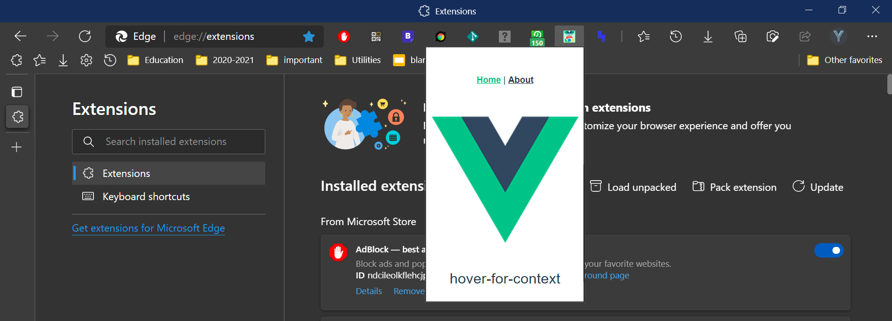
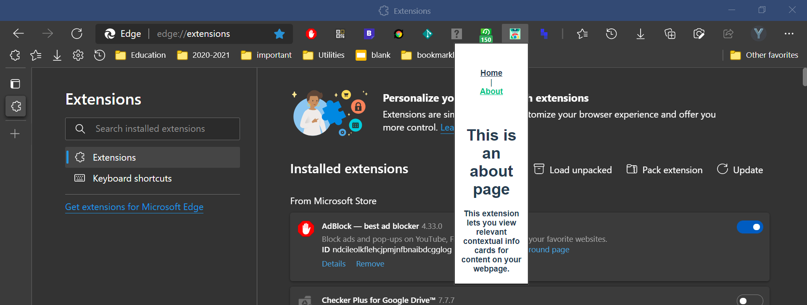

# hover-for-context

_This extension lets you view relevant contextual info cards for content onyour webpage._




Authors: Yonah Aviv & _____


© 2021 Y330


## Project setup
```
pnpm install
```

### Compiles and hot-reloads for development
```
pnpm run serve
```

### Compiles and minifies for production
```
pnpm run build
```

### Lints and fixes files
```
pnpm run lint
```

### Customize configuration
See [Configuration Reference](https://cli.vuejs.org/config/).
